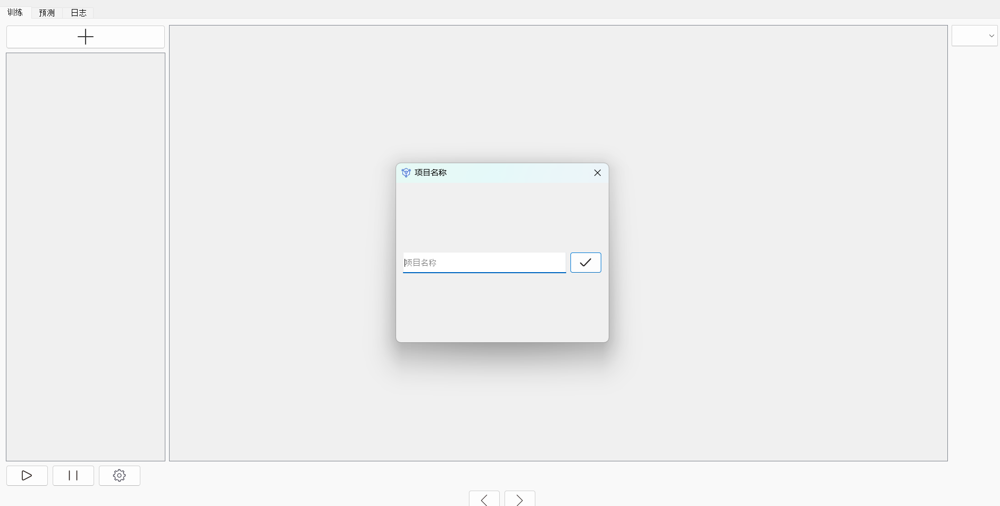
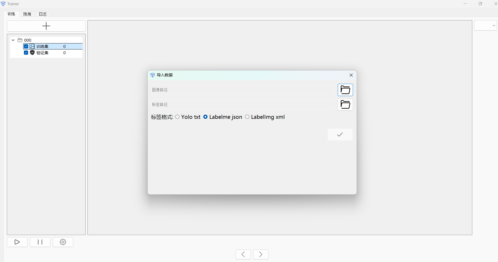

# easy2yolo(in development.)

## Introduction

easy2yolo is a user-friendly graphical interface application developed using Python and PyQt5. This tool simplifies the process of creating training projects for object detection tasks, particularly those utilizing the YOLO (You Only Look Once) framework.

## Features

- **Project Creation**: Easily create new training projects.
- **Dataset Import**: Supports importing datasets in various formats including:
  - YOLO `.txt`
  - LabelMe `.json`
  - LabelImg `.xml`
- **Training Parameter Configuration**: Customize parameters for your training sessions.
- **Dataset Management**: Manage and organize your datasets efficiently.
- **Training Logs**: View detailed logs of your training sessions.
- **Result Visualization**: Quickly visualize the results of your training.

## Getting Started

### Installation

1. Ensure you have Python installed on your system.
2. Install the required dependencies by running:
   ```bash
    pip install -r requirements.txt
   ```
3.Run the application:
```bash
    python main.py
```
##Usage
- Creating a New Project
- Open the application.
- Click on the + button to create a new project.
- Enter the project name and click OK.

## Importing Datasets
- Navigate to the Dataset tab.
- Click on Import Dataset
- Select the dataset file(s) from your local directory.

## Configuring Training Parameters
- Go to the Training tab.
- Adjust the parameters as needed for your training session.
## todolist
- importing datasets
- manager datasets
- configuring train and predict
## Screenshots
 
 

## Contributing
- We welcome contributions! If you find any bugs or have suggestions for improvements, please open an issue or submit a pull request.

## License
- GPL-3.0 license